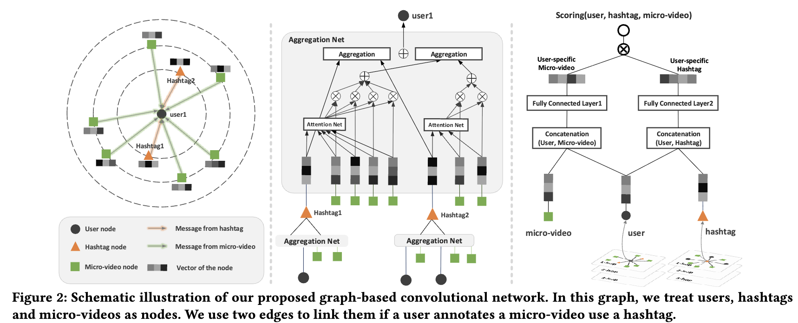

# Personalized Hashtag Recommendation for Micro-videos

> A novel Graph Convolution Network based Personalized Hashtag Recommendation (GCN-PHR) model, which leverages GCN techniques and attention mechanism to model complicated interactions among <users, hashtags, micro-videos>.
---

## Authors

**Yinwei Wei**<sup>1</sup>, **Zhiyong Cheng**<sup>2</sup>, **Xuzheng Yu**<sup>1</sup>, **Zhou Zhao**<sup>3</sup>, **Lei Zhu**<sup>4</sup>, **Liqiang Nie**<sup>1</sup>\*

<sup>1</sup> Shandong University, China  
<sup>2</sup> Qilu University of Technology (Shandong Academy of Sciences), China  
<sup>3</sup> Zhejiang University, China  
<sup>4</sup> Shandong Normal University, China  
\* Corresponding author

---
## Links

- **Paper**: [`ACM MM'19`](https://dl.acm.org/doi/abs/10.1145/3343031.3350858)
- **Code Repository**: [`GitHub`](https://github.com/weiyinwei/PHR_GCN)

---

## Table of Contents

- [Updates](#updates)
- [Introduction](#introduction)
- [Highlights](#highlights)
- [Method / Framework](#method--framework)
- [Project Structure](#project-structure)
- [Installation](#installation)
- [Dataset / Benchmark](#dataset--benchmark)
- [Usage](#usage)
- [License](#license)

---

## Updates

- [08/2019] Paper released on arXiv and accepted to ACM MM 2019.

---

## Introduction

This is the official PyTorch implementation for the ACM MM 2019 paper **Personalized Hashtag Recommendation for Micro-videos**.

**GCN_PHR** is a novel graph convolutional networks (GCN) based personalized hashtag recommendation method tailored for micro-videos. It considers both users' preferences on post contents and their personal understanding of hashtags. By treating users, hashtags, and micro-videos as nodes in a graph, our model leverages message-passing strategies to learn their representations based on direct associations. 

---

## Highlights

- **Novel Graph-Based Modeling**: Designs a GCN-based framework to explicitly model the complex interactions among `<users, hashtags, micro-videos>`.
- **Attention Mechanism**: Employs an attention mechanism to filter redundant messages passed from micro-videos to users and hashtags, which significantly enhances representation learning.
- **Flexible Configurations**: Supports multiple aggregation modes (`mean`, `max`, `add`) and scoring integration methods (`cat`, `fully_con`).
- **Comprehensive Baselines**: Compares with established methods like UTM, ConTagNet, CSMN, and USHM.

---

## Method / Framework



---

## Project Structure

```
.
├── Data_Partition.py      # Script for data splitting
├── Dataset.py             # Data loading and processing script
├── model.py               # Core GCN_PHR model and architecture
├── train.py               # Training loop and evaluation logic
└── README.md
```
---

## Installation
The code has been tested running under Python 3.5.2. The required packages are as follows:
- Pytorch == 1.1.0
- torch-cluster == 1.4.2
- torch-geometric == 1.2.1
- torch-scatter == 1.2.0
- torch-sparse == 0.4.0
- numpy == 1.16.0

## Dataset / Benchmark

Baselines:  

  - `UTM` proposed in [User conditional hashtag prediction for images](http://www.thespermwhale.com/jaseweston/papers/imagetags.pdf), SIG KDD2015. 
  - `ConTagNet` proposed in [ConTagNet: Exploiting usercontext for image tag recommendation
](https://www.researchgate.net/publication/308855153_ConTagNet_Exploiting_User_Context_for_Image_Tag_Recommendation), ACM MM2016.[[CODE](https://github.com/vyzuer/contagnet)] 
  - `CSMN` proposed in [Attend to You: Personalized Image Captioning with Context Sequence Memory Networks](http://zpascal.net/cvpr2017/Park_Attend_to_You_CVPR_2017_paper.pdf), CVPR2017.[[CODE](https://github.com/cesc-park/attend2u)]
  - `USHM` proposed in [Separating self-expression and visual content in hashtag supervision](https://arxiv.org/abs/1711.09825), CVPR2018. 
## Dataset
We provide two processed datasets: YFCC100M and Instagram.  
- You can find the full version of dataset via [YFCC100M](https://multimediacommons.wordpress.com/yfcc100m-core-dataset/) and raw data [Instagram]().
- We select some users and micro-videos and extract the visual, acoustic, and textual features of micro-video.

||#Micro-video|#User|#Hashtag|Visual|Acoustic|Textual|
|:-|:-|:-|:-|:-|:-|:-|
|YFCC100M|134,992|8,126|23,054|2,048|128|100|
|Instagram|48,888|2,303|12,194|2,048|128|100|

---

## Usage
The instruction of commands has been clearly stated in the codes.
- YFCC100M dataset  
`python train.py --l_r=0.001 --weight_decay=0.1 --batch_size=1024 --dim_latent=64 --num_workers=30 --aggr_mode='mean' --scoring_mode='cat'`
- Instagram dataset  
`python train.py --l_r=0.001 --weight_decay=0.1 --batch_size=1024 --dim_latent=64 --num_workers=30 --aggr_mode='mean' --scoring_mode='cat'` 

Some important arguments:  
- aggr_mode  
  It specifics the type of aggregation layer. Here we provide three options:  
  1. `mean` (by default) implements the mean aggregation in aggregation layer. Usage `--aggr_mode 'mean'`
  2. `max` implements the max aggregation in aggregation layer. Usage `--aggr_mode 'max'`
  3. `add` implements the sum aggregation in aggregation layer. Usage `--aggr_mode 'add'`
- `scoring_mode`:  
  It indicates the implementation of user-specific micro-video/hashtag representation. Here we provide two options:
  1. `cat`(by default) concatenates the representation of user and micro-video/hashtag, and then feed into a MLP to calculate the representations. Usage `--scoring_mode 'cat'`
  2. `fully_con` calculates the user-specific micro-video/hashtag representations with a fully connected layer. Usage `--concat 'fully_con'`


-`train.npy`  
   Train file. Each line is a user with her/his hashtag towards the micro-video: (userID, Hashtag ID and micro-video ID)  
-`val.npy`  
   Validation file. Each line is a user with her/his 1,000 negative hashtags and several positive hashtags for a micro-video: (userID, Neg_Hashtag ID, Pos_Hashtag ID, and micro-video ID)  
-`test.npy`  
   Test file. Each line is a user with her/his 1,000 negative hashtags and several positive hashtags for a micro-video: (userID, Neg_Hashtag ID, Pos_Hashtag ID, and micro-video ID) 

---
# License

Copyright (C) <year>  Shandong University

This program is licensed under the GNU General Public License 3.0 (https://www.gnu.org/licenses/gpl-3.0.html). Any derivative work obtained under this license must be licensed under the GNU General Public License as published by the Free Software Foundation, either Version 3 of the License, or (at your option) any later version, if this derivative work is distributed to a third party.

The copyright for the program is owned by Shandong University. For commercial projects that require the ability to distribute the code of this program as part of a program that cannot be distributed under the GNU General Public License, please contact <weiyinwei@hotmail.com> to purchase a commercial license.


